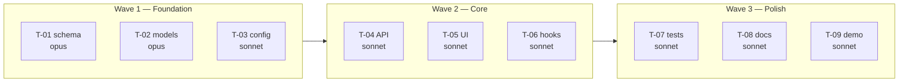
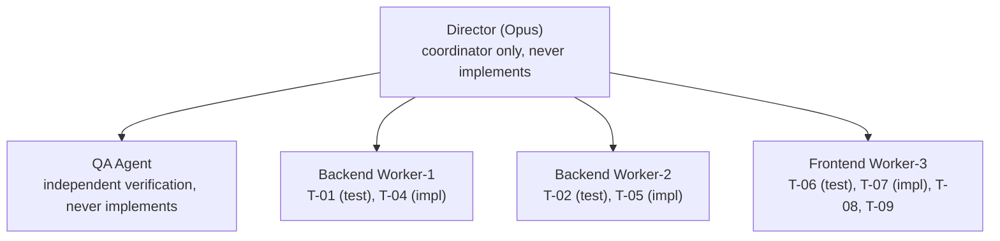

# /sprint-exec-plan — Sprint Execution Plan

```
┌─ THE FLYWHEEL ──────────────────────────────────────────────────────────┐
│ SHAPE → PLAN → REVIEW×N → DECOMPOSE → ★SPRINT PLAN → EXECUTE → CLOSE  │
│ ★ YOU ARE HERE: Analyze beads into waves + team. Last step before go.   │
│ See FLYWHEEL.md for the full development lifecycle.                     │
└─────────────────────────────────────────────────────────────────────────┘
```

Read-only analysis of your beads backlog. Produces a sprint brief with wave plan,
cost tiers, team topology, and mermaid deployment diagram. No team creation — this
is the thinking step before `/hs-sw-sprint-go`.

## Process

### Step 1 — Inventory

- `bd list --status=open` to get all open tickets
- `bd show <id>` for each ticket to get full context
- `bd graph --all` for dependency structure
- Read AGENTS.md for project context, quality gates, verification entry points

### Step 2 — Verification Entry Points (HARD GATE)

- Check AGENTS.md for a "Verification Entry Points" section (persona journeys per
  feature area). If configured: create missing verification tickets with `bd create`.
  If no section: note and suggest adding one — but the gate below applies regardless.
- **Verification-altitude gate (GH#360 retro, 2026-06-10):** the plan CANNOT be
  finalized unless every user-facing impl bead maps to a persona-journey assertion
  in some VERIFY bead. A valid VERIFY acceptance criterion has three parts:
  **persona** ("as the invited user"), **surface** ("in the workspace switcher"),
  **visible end-state** ("the joined workspace appears"). Mechanism assertions
  (DB rows created, API status codes) are allowed only IN ADDITION — a VERIFY bead
  whose criteria are mechanism-only is defective; rewrite it before finalizing.
  VERIFY beads must run on DEFAULT config/ports (the environment a real user hits),
  not a bespoke test setup.
- Wire as dependents of implementation tickets they verify
- Place in final wave

### Step 3 — TDD Pairing Check

Before wave analysis, verify TDD structure:

- For each impl bead with testable acceptance criteria: does a companion test bead exist?
- Does the test bead block the impl bead?
- If missing: create the test bead with `bd create` and wire dependencies
- Test beads should be in the same wave or one wave before their impl bead
- Log any test beads created: `bd comments add <id> "Sprint plan: created TDD pair"`

### Step 4 — Wave Analysis

- Build DAG from beads dependencies (including TDD pairs)
- Group into waves: Wave 1 = no deps, Wave N = deps all in 1..N-1
- Name waves by dominant work type (Foundation / Core / Integration / Polish)
- Verify test beads appear in same or earlier wave than their impl beads
- Flag cycles — must resolve before proceeding

### Step 5 — Model Tier Labeling

Apply tiers via `bd update <id> --add-label tier:<tier>` (three tiers, 2026-06-10):

- `fable`: HEAVY — architectural decisions, complex multi-file refactors, high
  fan-out (blocks 3+), protocol/auth/security-critical design, subtle debugging
- `opus`: STANDARD — features, API endpoints, UI components, test writing,
  contract tests, non-trivial fixes
- `sonnet`: TRIVIAL — mechanical/boilerplate, config, docs, copy/label changes

Do NOT use `haiku` tier. See AGENTS.md "Model Tiers" for role defaults
(Director=fable, reviewers=opus, QA=sonnet).

Respect existing ticket labels — don't overwrite user-assigned ones.

### Step 6 — Domain Balance Check

Count beads by domain (backend, frontend, infra, tests). Flag imbalances:

- **BLOCK** if any domain has impl beads but no worker assigned to it
- **WARN** if >30% of beads are frontend but no frontend-specialized worker
- **WARN** if frontend and backend beads exist in the same wave but only one
  domain has a worker
- **WARN** if a domain has impl beads but zero test beads

Present domain distribution to user:
```
Backend: 15 impl + 8 test = 23 beads
Frontend: 10 impl + 5 test = 15 beads
Infra: 3 impl + 0 test = 3 beads  ⚠️ no test coverage
```

### Step 7 — Team Topology

- **Worker count = TRUE PARALLEL WIDTH, always.** The escape-rate gate no longer
  throttles width directly (revised 2026-06-10 — GH#360 retro: a blanket "hold at 2"
  falsely serializes work the lane analysis already proved parallel-safe). The gate
  changes WHAT YOU DO, not how many workers run:
  - Read the trailing escape rate from `~/.claude/flywheel/sprint-metrics.jsonl`
    (or `/hs-sw-flywheel-metrics`), and split it by source where the entries allow:
    **worker-code rework** (defects in sprint-written code) vs **planner misses**
    (verification scope, ticket enrichment).
  - Trailing rate **≥20%** → a `/hs-sw-beads-review` enrichment pass over this
    sprint's beads is MANDATORY before finalizing the plan, and Step 2's
    verification-altitude gate gets extra scrutiny. Only a high **worker-code**
    component argues for shrinking width below the lane-derived number — planner
    misses are fixed by better beads, not fewer workers.
  - Trailing rate **<20%**: proceed at full lane width; the 5-worker ceiling may
    rise.
  - No log yet (first sprint): full lane width, ceiling 5.
- **Cap worker count by TRUE parallel width, not ticket count.** Read the
  file-overlap graph from `/hs-sw-beads-review` (built from each bead's `## Files`
  section). For each wave, the real parallelism is the largest set of beads whose
  file-sets are mutually **disjoint** — not the raw ticket count. Example: a wave
  of 8 beads where 6 all touch `schema.py` has a true width of 3, so 3 workers, not 8.
  `tickets / 4` is only the ceiling; the disjoint-set width is the actual number.
- **Pre-compute co-assignment lanes.** Beads that overlap on files but have no
  logical dependency get grouped into ONE worker's lane (that worker holds the
  shared file start-to-finish → zero collision). Assign lanes in the topology so
  the Director inherits a collision-free starting plan. Two beads that both
  `create` the same path should have been merged in review — if one survives,
  flag it back.
- Agent count: min(true parallel width, 5) — collision structure (lanes) is the
  binding constraint; the 5-ceiling may rise when the trailing escape rate is <20%.
- Logical groupings: analyze domains (backend/frontend/infra or by label)
- **Every domain with beads MUST have at least one worker** — this is the rule
  that prevents "backend done, frontend skipped"
- Manager layer: only if 4+ workers; otherwise Director manages directly
- Director: always one, always **fable**-tier (coordination judgment is the
  highest-leverage spend; planning quality drives the escape rate)
- QA agent(s): a SMALL FIXED POOL parallelized by logical group — **never one
  agent per ticket**. 1 per 1-3 workers; 2 (split by domain) for 4-5. Each QA
  works its queue sequentially; heavyweight steps (`npm run build`, full suites)
  serialized across instances by the Director. Do not count toward worker cap.
- **Standing lens reviewers are part of the topology** (the launcher spawns them;
  the Director cannot spawn): one `hs-sw-sprint-bug-hunter` per lens — correctness,
  security, compaction, + ux when frontend beads exist. List them by name in the
  Director brief roster.
- **Director brief MUST state the labeling contract:** every fix-bead filed after
  a ticket is qa-passed carries `caught:review|manual|pr` — whoever files it.
  Unlabeled repair work is invisible to the escape-rate metric.
- TDD consideration: plan for test-writer / implementer separation on fable tickets

### Step 8 — Generate Sprint Brief

Two artifacts:

**A. Deployment Diagram — mermaid in the file, ASCII on screen:**

The diagram has two renderings and you produce both:

- **Written to the plan files** (`tmp/sprint-exec-plan.md`, `<feature_dir>/sprint-plan.md`)
  → **mermaid**. Those files are read in GitHub/VS Code/Obsidian, where mermaid renders.
- **Presented in conversation** (Step 9) → **ASCII**. The terminal does not render
  mermaid; a mermaid fence on screen is unreadable source. See Step 9 for that form.

Mermaid form — wave plan — one subgraph per wave, tier in the node label:


Mermaid form — team topology, Director at the root, agents as children:


Tier goes in the node label (`fable` / `opus` / `sonnet`) — no legend needed.
In mermaid node labels use `<br/>` for line breaks; avoid `\n`, which some
renderers show literally.

**B. Director Brief** — self-contained markdown with:
- Project, branch, tech stack, quality gates
- Wave plan with ticket IDs, titles, tiers, dependencies
- Team topology with agent assignments
- Role switching rules (impl → test → docs → marketing → fresh-eyes)
- Autonomy mandate

### Step 9 — Persist + Present

- Determine the feature directory. Look at the beads epic or ask the user:
  "What feature directory should I use? (e.g., `docs/projects/features/org-management/`)"
- Write full plan to `tmp/sprint-exec-plan.md` (for sprint-go to read)
- **Also write to `<feature_dir>/sprint-plan.md`** — this is the persistent copy
  that lives alongside PLAN.md and pitch.md. Include the `feature_dir` path in
  the plan so the Director knows where to write checkpoints.
- **Generate `tmp/sprint-status.sh`** — sprint status line script for Claude Code:
  - Get the project root absolute path via `pwd`
  - Hardcode all ticket IDs and wave-to-ticket mapping (known from Step 4)
  - Script queries `bd show <all-ids> --json` in one call, formats output as:
    `Sprint: ■■▣□□ 2/5 done · W1:✓ W2:◐ W3:○`
  - **Completion = `qa-passed` label** (agents never close beads — humans do after review)
  - Use symbols: `■` qa-passed (done), `▣` in_progress, `□` open; `✓` wave done, `◐` wave active, `○` wave pending
  - Detection logic: `if "qa-passed" in item.get("labels", []) → "done"`, else use `item["status"]`
  - Falls back to `"Sprint: loading..."` if bd or python fails
  - See `docs/features/sprint-status-line/statusupdate.md` for full script template (copy it exactly)
  - Make executable: `chmod +x tmp/sprint-status.sh`
  - Verify it runs: `bash tmp/sprint-status.sh`
- **Configure the project-level `.claude/settings.json`** with the status line:
  - This is `<project-root>/.claude/settings.json` — NOT `~/.claude/settings.json` (never write to global settings)
  - Read existing `.claude/settings.json` (or start from `{}` if missing)
  - Merge in: `"statusLine": {"type": "command", "command": "bash <abs-path>/tmp/sprint-status.sh"}`
  - Write back — preserve all other existing settings
- Present the **ASCII** diagram + topology + cost summary in conversation. Never paste
  the mermaid fence on screen — the terminal renders it as raw source. Same content,
  ASCII form:
  ```
  Wave 1 (Foundation)     Wave 2 (Core)        Wave 3 (Polish)
  ┌─────────────────┐    ┌────────────────┐    ┌────────────────┐
  │ T-01 schema  ◆  │    │ T-04 API    ●  │    │ T-07 tests  ●  │
  │ T-02 models  ◆  │───▶│ T-05 UI     ●  │───▶│ T-08 docs   ●  │
  │ T-03 config  ●  │    │ T-06 hooks  ●  │    │ T-09 demo   ●  │
  └─────────────────┘    └────────────────┘    └────────────────┘
  ★ = fable  ◆ = opus  ● = sonnet

  Director (Opus) — coordinator only, never implements
  ├── QA Agent — independent verification, never implements
  ├── Backend Worker-1: T-01 (test), T-04 (impl)
  ├── Backend Worker-2: T-02 (test), T-05 (impl)
  └── Frontend Worker-3: T-06 (test), T-07 (impl), T-08, T-09
  ```
- Tell user: "Review and adjust, or run `/hs-sw-sprint-go` to launch"

## Rules

- **Diagrams: mermaid in files, ASCII on screen.** Anything written to a `.md` file
  uses mermaid; anything presented in conversation uses ASCII, because the terminal
  can't render mermaid.
- Use extended thinking for wave analysis and topology decisions
- All ticket operations use `bd` CLI
- If dependency graph has cycles: report and stop
- Respect existing ticket labels — don't overwrite user-assigned ones
- This is read-only analysis (except verification ticket creation and tier labels)
