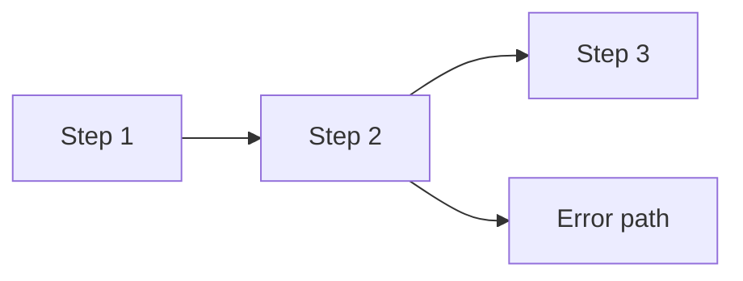
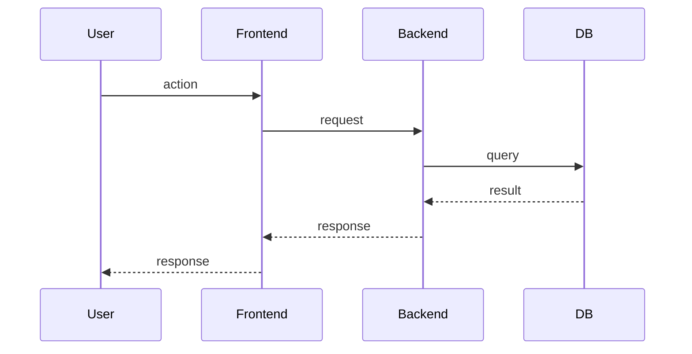

# [Version/Feature] PLAN: [Short Name]

**Date:** YYYY-MM-DD
**Status:** Draft — iteration N
**Author:** [name]
**Goal:** [One sentence. What the user can do after this ships that they can't do today.]
**Scope:** [feature | dot-release | major-release | architecture]

---

## The One-Line Version

[Elevator pitch. One sentence that captures the entire thing. If you can't say it
in one sentence, you don't understand it well enough yet.]

---

## Goals

[3-5 concrete, measurable outcomes. Each should be verifiable — how do you know
this goal was achieved?]

1. ...
2. ...
3. ...

## Non-Goals

[Explicitly state what this plan does NOT cover. This is just as important as the
goals — it prevents scope creep during review and implementation.]

- ...
- ...

## Success Criteria

[How do you know this is done? Concrete metrics or acceptance conditions, not
vibes. These become the top-level acceptance criteria for your beads.]

| Criterion | Measurement |
|-----------|-------------|
| ... | ... |

---

## Context

### What exists today

[What's already built and working that this plan builds on. Be specific — file
paths, table names, API endpoints. An agent reading this should understand the
starting point without reading other docs.]

### What's broken or missing

[The problems this plan solves. For each, explain why it matters to the user, not
just that it's technically wrong.]

### What already works (build on, don't rebuild)

[Things people might assume need rebuilding but actually don't. Prevents wasted
work. Include file paths so agents can find them.]

### What's NOT in scope

[Overlap with Non-Goals but more detailed. Explain what the adjacent/future work
is so readers understand the boundaries. Reference the plan or version that will
cover it.]

---

## Architecture

### High-Level Design

[How the system works end-to-end. **A diagram is required — not optional.**
Use mermaid. This section should let someone understand the architecture in
2 minutes. If you can't draw it, you don't understand it well enough yet.]

```mermaid
[REQUIRED: mermaid diagram of components and data flow]

Example:
flowchart LR
  U[User] --> FE[Frontend]
  FE --> API[API]
  API --> SVC[Service]
  SVC --> DB[(Database)]
  API --> EXT[External API]
```

[Add more diagrams as needed. One diagram per flow/concern is clearer than
trying to show everything in one. Common additions:]

**User Flow** *(required if there's a user-facing interaction)*


**Sequence Diagram** *(required if there are async operations or multi-actor flows)*


### Key Decisions

[Major architectural choices with rationale. For each decision, explain what
alternatives were considered and why this one won. Link to decision docs if
they exist, but include enough context here to be self-contained.]

| Decision | Chosen | Why | Alternatives Considered |
|----------|--------|-----|------------------------|
| ... | ... | ... | ... |

### Data Model

[Tables, schemas, or data structures that are created or modified. Include enough
detail for an agent to write the migration.]

### API Surface

[New or modified endpoints/interfaces. Include enough detail for an agent to
implement them.]

---

## Implementation

### Deliverables

[The concrete units of work, ordered by dependency. Each deliverable should map
to an epic or major task in beads. Include enough detail that an agent can
understand what "done" means without reading other docs.]

#### D1: [Name]

**What:** [What gets built]
**Why:** [Why this is needed — connect to goals]
**Depends on:** [Other deliverables, or "nothing"]
**Acceptance criteria:**
- [ ] ...
- [ ] ...

**Key details:**
[Implementation-relevant specifics. Not pseudo-code, but enough that an agent
doesn't have to guess at the approach. Include file paths, function signatures,
database queries — whatever is needed to be unambiguous.]

#### D2: [Name]

...

### Implementation Phases

[Group deliverables into phases if there's a natural ordering beyond just
dependencies. Each phase should result in something testable.]

| Phase | Deliverables | What's testable after |
|-------|-------------|----------------------|
| 1 | D1, D2 | ... |
| 2 | D3, D4 | ... |

---

## Testing Strategy

[How this will be tested. Not just "write tests" — specify what kinds of tests,
what they cover, and what the acceptance bar is.]

- **Unit tests:** ...
- **Integration tests:** ...
- **Manual verification:** ...

---

## Deployment & Rollout

[How this gets to users. Include any migration steps, feature flags, rollback
plan, or monitoring.]

---

## Open Questions

[Things you know you don't know yet. Acknowledge them explicitly rather than
pretending they don't exist. For each, note when/how it will be resolved.]

- [ ] ...
- [ ] ...

---

## References

[Links to decision docs, design docs, external resources, prior art. These are
supplementary — the plan itself should be self-contained.]

- ...
